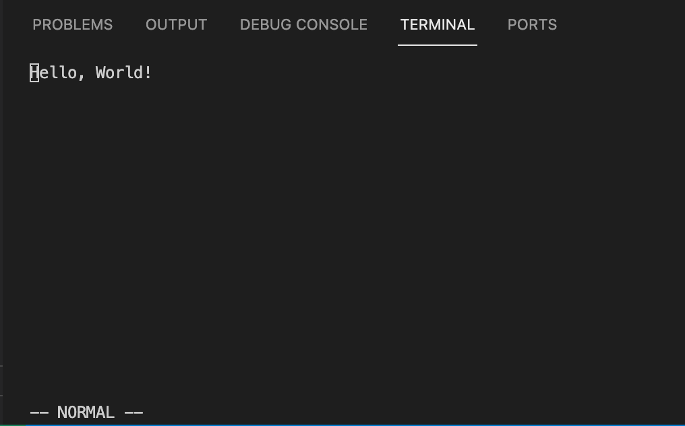
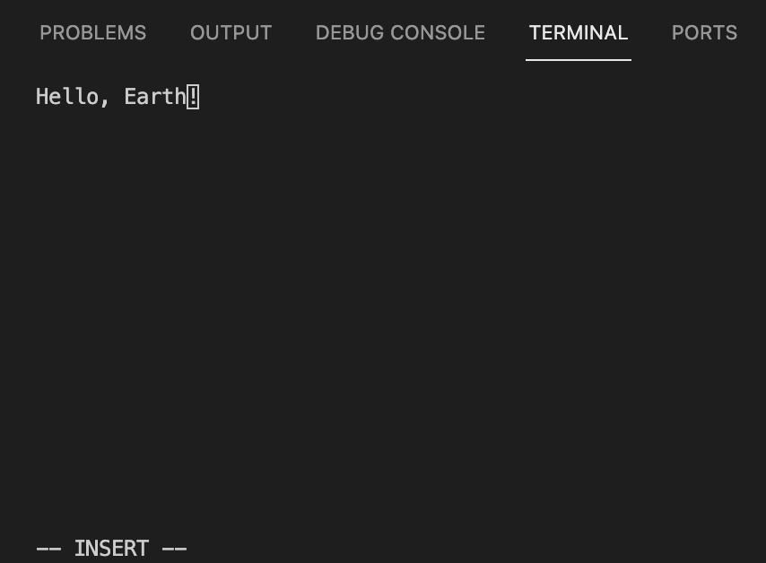
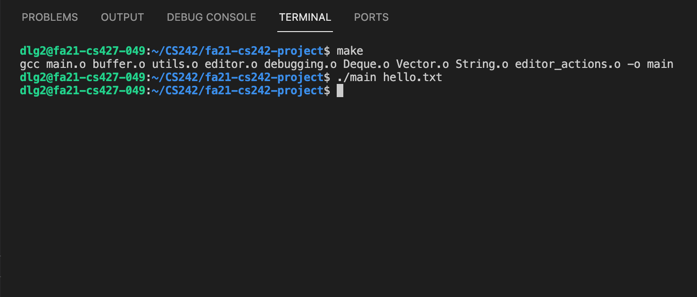
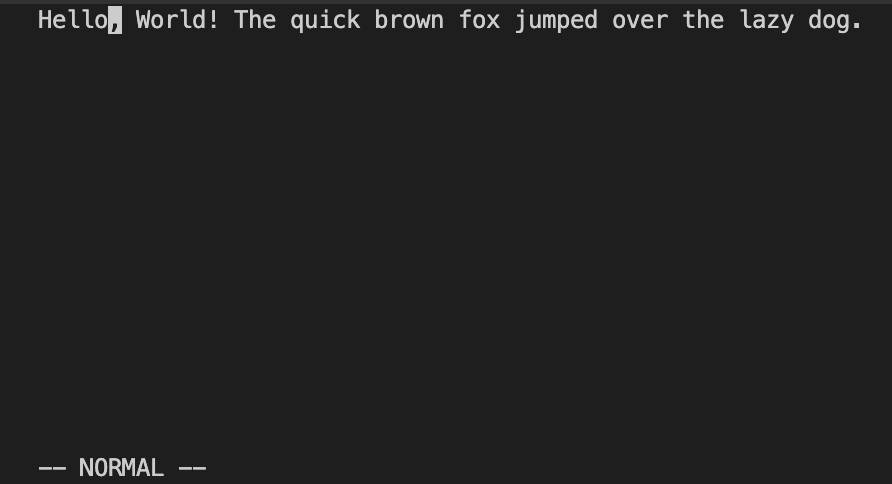
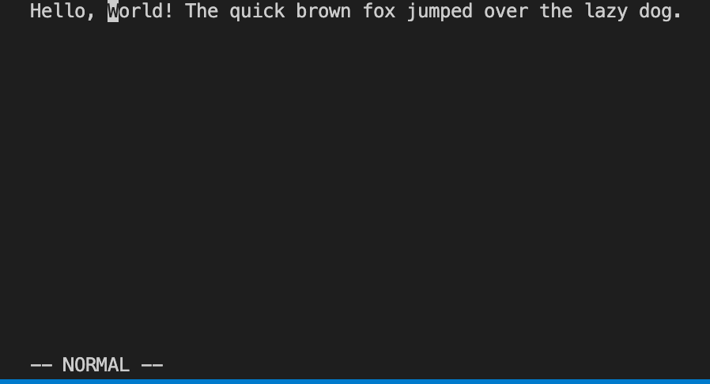
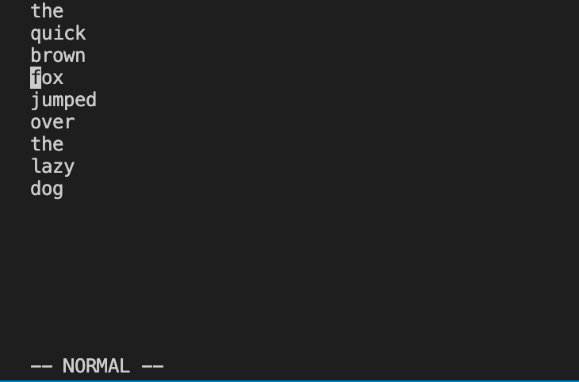
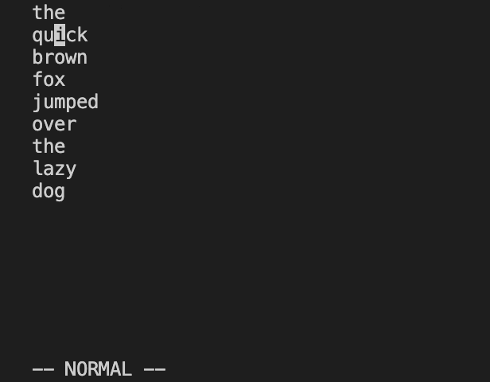

# Manual Test Plan for dlg2/jcpeng2 fa-21-CS242-project week 1

------

- Environment Setup
  - Linux OS
  - Terminal with Xterm alternate screen buffer support

##### Begin by cloning the repository and navigating to the project root folder. Make the main executable by running:
`make`

##### To avoid damaging project files when testing, create some test file by running the following command:
`echo "Hello, World!" >> hello.txt`

------
# Test 1.0 - Editor Display
- In the same directory, run the command `./main hello.txt`. 
- The terminal should clear the previous content and display the contents of hello.txt, plus a bar at the bottom of the screen indicating that you are in `NORMAL` mode.

# Test 1.0 - Editing text using INSERT mode
 - With the editor still open, press the `i` key on your keyboard.
 - Using the arrow keys, navigate past the end of the word "World" in the editor.
 - The bottom bar of the editor should now display `-- INSERT --`.
 - Press the delete key until you have deleted the word "World", then type the word "Earth". The editor should appear as follows:

### Test 1.1 - Exiting the editor
 - To save your changes, first press `ESC` to re-enter `NORMAL` mode.
 - Type `:w`. As you type, the command should appear in the bottom bar of the editor. After you've typed it, press `Enter`.
 - The bottom bar should now say `-- File saved --`.
 - Type `:q` then press `Enter` to exit the editor.
 - Your terminal should now display the contents it showed before displaying the editor, similar to the image below.

### Test 1.2 - Viewing saved changes.
 - To check that our changes in Test 2.0 were saved, re-open the file using the editor by entering the following command again: `./main hello.txt`.
 - The contents of the file should reflect what you changed it to earlier: "Hello, Earth!".

### Test 1.3 - Navigating the file
 - Lengthen the file somewhat by entering `INSERT` mode and typing several new lines of text into the file.
 - Exit `INSERT` mode by pressing `ESC`. Now you should be in `NORMAL` mode.
 - Press the following key combo: `gg`. This should navigate your cursor to the top left of the file.
 - Similarly, press the following key combo: `Shift G`. Your cursor should now be at the bottom left of the file.

### Test 1.4 - Undoing changes
 - In the same file as Test 1.3, enter `NORMAL` mode by pressing `ESC` if you are not already in it.
 - Press the `u` key. The changes you made to the file in Test 1.3 should be gone, and the file should simply read "Hello, Earth!"
------
### Test 2.0 - Searching for characters (forwards)
 - Close the editor by pressing `Control c` to exit without saving.
 - Re-run the editor on a different file: `./main tests/dummy.txt`
 - While in `NORMAL` mode, press the `f` key followed by some character to search for. The cursor should now move to the next occurrence of that character in the same line.

### Test 2.1 - Searching for characters (backwards)
 - In the same file as Test 2.0, navigate (using arrows keys or more searching) to some part of the line in the middle.
 - Press `F` (capitalized) to search *backwards* for a character in the line. The cursor should move to the previous occurrence of that character, if present.
 - Press `fz` twice to ensure that the cursor does not search forwards when there are no occurrences left in the line.
 - Similarly, press `FW` twice to ensure that the cursor does not search backwards when there are no occurences left before the cursor.

### Test 2.2 - Skipping words (with punctuation)
 - In the same file as the previous 2 tests, navigate back to the start of the line using the arrow keys.
 - Press the `w` key.
 - The cursor should now skip to the next 'word'. In this case, a 'word` is defined as the next non-underscore punctuation character that is distinct from the character at the cursor's starting position, or the next alphanumeric character with at least one whitespace character between it and the cursor's starting position.

### Test 2.3 - Skipping words (without punctuation)
- In the same file as the previous tests, navigate back to the start of the line using the arrow keys.
- Press the `W` key.
- The cursor should now skip to the next 'word'. In this case, a 'word` is defined as the next alphanumeric character with at least one whitespace character between it and the cursor's starting position.

### Test 2.4 - Searching for words (forwards)
- Close the editor by pressing `Control c` to exit without saving.
- Re-run the editor on a different file: `./main tests/multi_line_text.txt`.
- While in `NORMAL` mode, press the forward slash key `/` to begin a search query.
- Then, type in a query to search for in the file. For example: `/fox`. Once you've finished typing the query, press `ENTER`.
- The cursor should move to the next occurrence of that query (without the preceeding forward slash) in the file.

### Test 2.5 - Searching for words (backwards)
- In the same file as in Test 2.2, navigate to some line in the middle of the file beyond line 2.
- Press `?` while in `NORMAL` mode to begin a *backwards* search.
- Enter the full query `?ick` then press `ENTER`. The cursor should move part-way through line 2 of the file to the first (and only) occurrence of this text in the file.

