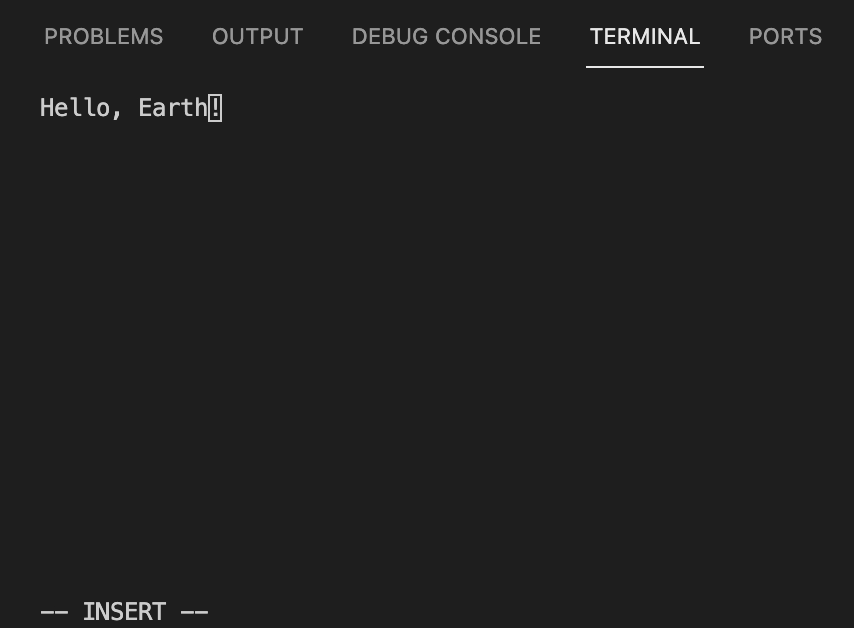

# Manual Test Plan for dlg2/jcpeng2 fa-21-CS242-project week 1

------

- Environment Setup
  - Linux OS
  - Terminal with Xterm alternate screen buffer support

##### Begin by cloning the repository and navigating to the project root folder. Make the main executable by running:
`make`

##### To avoid damaging project files when testing, create some test file by running the following command:
`echo "Hello, World!" >> hello.txt`

------
# Test 1.0 - Editor Display
- In the same directory, run the command `./main hello.txt`. 
- The terminal should clear the previous content and display the contents of hello.txt, plus a bar at the bottom of the screen indicating that you are in `NORMAL` mode.

# Test 1.0 - Editing text using INSERT mode
 - With the editor still open, press the `i` key on your keyboard.
 - Using the arrow keys, navigate past the end of the word "World" in the editor.
 - The bottom bar of the editor should now display `-- INSERT --`.
 - Press the delete key until you have deleted the word "World", then type the word "Earth". The editor should appear as follows:

### Test 1.1 - Exiting the editor
 - To save your changes, first press `ESC` to re-enter `NORMAL` mode.
 - Type `:w`. As you type, the command should appear in the bottom bar of the editor. After you've typed it, press `Enter`.
 - The bottom bar should now say `-- File saved --`.
 - Type `:q` then press `Enter` to exit the editor.
 - Your terminal should now display the contents it showed before displaying the editor, similar to the image below.

### Test 1.2 - Viewing saved changes.
 - To check that our changes in Test 2.0 were saved, re-open the file using the editor by entering the following command again: `./main hello.txt`.
 - The contents of the file should reflect what you changed it to earlier: "Hello, Earth!".

### Test 1.3 - Navigating the file
 - Lengthen the file somewhat by entering `INSERT` mode and typing several new lines of text into the file.
 - Exit `INSERT` mode by pressing `ESC`. Now you should be in `NORMAL` mode.
 - Press the following key combo: `gg`. This should navigate your cursor to the top left of the file.
 - Similarly, press the following key combo: `Shift G`. Your cursor should now be at the bottom left of the file.

### Test 2.4 - Undoing changes
 - In the same file as Test 1.3, enter `NORMAL` mode by pressing `ESC` if you are not already in it.
 - Press the `u` key. The changes you made to the file in Test 1.3 should be gone, and the file should simply read "Hello, Earth!"