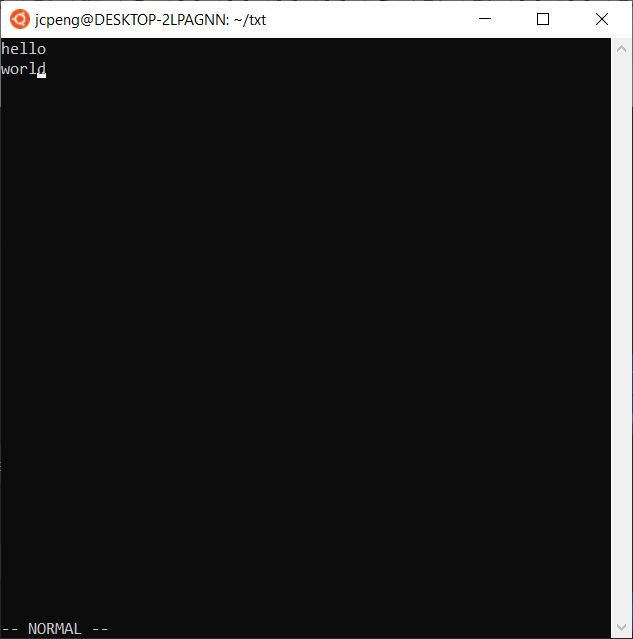

# Manual Test Plan for dlg2/jcpeng2 fa-21-CS242-project week 1

------

- Environment Setup
  - Linux OS
  - Terminal with Xterm alternate screen buffer support

##### Begin by cloning the repository and navigating to the project root folder. Make the main executable by running:
`make`

------
### Test 1 - Create a file
- In the same directory, run the command `./bin/main hello.txt`. 
- The terminal should clear the previous content and display an empty file,
    plus a bar at the bottom of the screen indicating that you are in `NORMAL` mode.
- Press `:wq` ENTER. The editor should exit, restoring your terminal state.
- Run `ls`. Verify that a new file `hello.txt` has been created. `cat hello.txt` should return empty.

### Test 2 - Create a file with content
- In the same directory, run the command `./bin/main hello2.txt`. 
- Type `i` to enter Insert Mode. Type 'hello' to see that you can type text. Press ESC to exit insert.

- Press `:wq` ENTER.
- Run `ls`. Verify that a new file `hello2.txt` has been created. `cat hello2.txt` should return the string 'hello'. (no trailing newline)

### Test 3 - Edit file with newlines
- In the same directory, run the command `./bin/main hello.txt`. 
- Type `i` to enter Insert Mode. Type 'hello', then press enter and type 'world'. Press ESC.

- Press `:wq` ENTER.
- Run `ls`. Verify that a new file `hello.txt` has been created.
- `cat hello.txt` should return the string 'hello' and the string 'world', separated by a newline. (no trailing newline)

### Test 4 - Quit without saving
- In the same directory, run the command `./bin/main hello2.txt`. 
- Press the right arrow until you have moved to the end of the line. Type `i` to enter Insert Mode.
- Press the right arrow key again once to move to the end of the line.
- Press ENTER. Type 'world'. Press ESC to exit insert.

- Press `:q` ENTER.
- `cat hello2.txt` should return the string 'hello'. (no trailing newline)

### Test 4 - `o` command
- In the same directory, run the command `./bin/main hello2.txt`. 
- Press `o`. This should create a newline and put you in insert mode.
- Type 'world'. Press ESC to exit insert.

- Press `:wq` ENTER.
- `cat hello2.txt` should return the string 'hello' and the string 'world', separated by a newline. (no trailing newline)

------

### Test 5 - `x` command
- In the same directory, run the command `./bin/main hello2.txt`. 
- Press `x`. Verify that a character has been deleted visually, and the text shifted left.
- Press `:wq` ENTER.
- `cat hello2.txt` should return the string 'ello' and the string 'world', separated by a newline. (no trailing newline)

### Test 6 - goto line command
- In the same directory, run the command `./bin/main hello2.txt`. 
- Press `:`. Verify that the left bottom bar has changed to reflect the mode change.
- Press `1`. Left bar should read `:1`.
- Press enter. Cursor should move to line 1 (zero indexed).
- Press `x`. Verify that a character has been deleted visually, and the text shifted left.
- Press `:wq` ENTER.
- `cat hello2.txt` should return the string 'ello' and the string 'orld', separated by a newline. (no trailing newline)

### Test 7 - number repeat command
- In the same directory, run the command `./bin/main hello2.txt`. 
- Press `2 j`. Cursor should move two columns to the right.
- Press `:wq` ENTER.
- `cat hello2.txt` should return the string 'ello' and the string 'orld', separated by a newline. (no trailing newline)

### Test 8 - number repeat command + delete
- In the same directory, run the command `./bin/main hello2.txt`. 
- Press `2 x`. Verify that two characters has been deleted visually, and the text shifted left.
- Press `:wq` ENTER.
- `cat hello2.txt` should return the string 'lo' and the string 'orld', separated by a newline. (no trailing newline)

### Test 9 - `$` command
- In the same directory, run the command `./bin/main hello2.txt`. 
- Press `j $`. Verify that the cursor moves to the end of the second line.
- Press `:wq` ENTER.
- `cat hello2.txt` should return the string 'lo' and the string 'orld', separated by a newline. (no trailing newline)

------

### Test 10 - 'A' command
- In the same directory, run the command `./bin/main hello.txt`. 
- Press `A`. Verify that the cursor moves to the end of the first line, and enters insert mode.
- Press ESC `:q` ENTER.

### Test 11 - '0' command- In the same directory, run the command `./bin/main hello.txt`. 
- Press `A` ESC.
- Press `0`. Verify that the cursor moves to the start of the line.
- Press `:q` ENTER.

### Test 12 - norm macro command
- In the same directory, run the command `./bin/main hello2.txt`. 
- Type `:norm2x` ENTER.
- Verify that 2 characters were deleted from the start of each line.
    - First line is now blank; second has `ld` left.
- `cat hello2.txt` should return the string '' and the string 'ld', separated by a newline. (no trailing newline)

### Test 13 - text overflow test
- In the same directory, run the command `./bin/main test.txt`.
- Enter insert mode. Type until the cursor fills up a full horizontal line.
- Observe that the buffer scrolls to the right.
- Exit insert mode. Press `0` to go to the start of the line.
- Observe that a highlighted `+` symbol indicates the line overflow.
- Exit with `:wq`.

### Test 14 - test `:tabnew`
- In the same directory, run the command `./bin/main test.txt`.
- Type `:tabnew hello.txt` ENTER.
- Verify that the second file is opened.
    - Should still say `hello` and `world` on separate lines.
- Type `:q` ENTER to close the new file. Verify that the buffer switches to the first file.
- Type `:q` ENTER to close the first file and exit.
